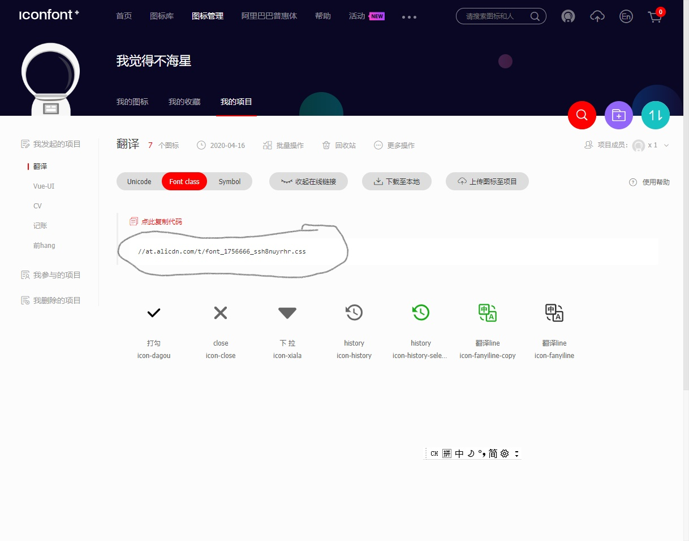

# 微信小程序总结

终于完成了微信翻译小程序，在完成小程序的过程中我发现其语法和Vue极其相似，所以想用者篇笔记对本次实战进行一次记录，并通过其与Vue的对比加深我对Vue的理解。

## 起步
关于微信小程序的帐号注册，开发，调试，发布在这里就不再赘述，具体内容可以在微信小程序的官方文档进行查阅。

## 目录结构分析


本次开发的微信翻译小程序较稳简单，所以目录结构也不复杂。所有的程序都包含在miniprogram内：
1. assets(资源)主要包含了整个页面的资源，本项目所使用的外部资源是一个iconfont资源，主要作用：为小程序引入外部图标。
2. pages包含了该小程序中所有的页面文件：index（首页、翻译页）、change（目标语言切换页）、history（翻译历史页）。每个页面内包含了以wxml、wxss、js和json为后缀的四种文件。wxml与html类似主要用于页面结构的实现。wxss与css类似。小程序的这种做法和vue的单文件组件类似，只不过Vue是单文件组件，微信小程序是单文件夹组件。
3. utils存储的是一个封装过的百度翻译api以及用于md5加密的min.js文件。
4. app.js内主要存储的是一些全局方法，或者全局数据，相当于充当了Vue中Vuex的作用，但详细来说还是有很大的区别的。
5. app.json主要是用于对小程序的全局配置，其中主要功能是：pages（用于注册页面），window（用于设置全局样式），tabBar（用于自定义导航栏）等。

## 各页面实现
该翻译软件分为翻译页，历史页，和目标语言选择页。

### 翻译页
翻译页分为语言选择跳转项、翻译文本输入框、翻译结果文本框以及导航栏。

#### tabBar导航栏
在app.json中配置
```
"tabBar": {
    "color":"#595959",
    "list": [{
      "pagePath": "pages/index/index",
      "text": "翻译",
      "iconPath": "pages/images/translate.png",
      "selectedIconPath": "pages/images/translate-selected.png"
    },
    {
      "pagePath": "pages/history/history",
      "text": "历史",
      "iconPath": "pages/images/history.png",
      "selectedIconPath": "pages/images/history-selected.png"
    }
  ]
  }
```

#### 语言选择跳转项 
该跳转项主要是通过<navigation>标签实现，该标签接受一个url属性，属性的值可以是绝对路径也可以是相对路径。该标签的使用方法和VueRouter的<router-link>标签的使用方法类似，其url属性对应<router-link>的to。需要注意的是<navigation>标签的url不可接受一个tabBar中的值，如果想要跳转到一个tabBar中的页面，应该使用wx.reLaunch方法。
#### 文本输入框
文本输入框中用到了各种数据绑定，值得一提的是微信小程序中的绑定事件有自己一套属性名bindtap对应onclick,bindinput对应oninput等等。在为小程序中不再有div，span等标签，这些标签分别由view、text代替。
输入框使用的是textarea标签实现。通过监听它的确认事件（bindconfirm）以及失焦事件(bindblur)来察觉用户输入是否完成。这与Vue中的onchanged监听一样。
在翻译文本框内，当用户输入了内容之后，会出现一个个叉的icon这是由iconfont外部引入的图标，其引入流程：
1. 在iconfont官网找到需要的图标，并将其加入项目中。
2. 生成fontclass代码；
3.复制其生成的代码在网页中打开；
4.在assets中创建一个iconfont.wxss文件，保存代码。
5.在需要使用时按照以下格式使用；
```
<text class="iconfont icon-close" ></text>
```
#### 翻译功能的实现
这个翻译小程序的翻译功能使用的是百度翻译的api，在使用这个api前，我先将其进行了封装：
微信中无法使用axios等AJAX库，但是它有自己的AJAX方法：wx.request。封装完成后使用即可。

### 目标语言选择页
目标语言选择页的实现较简单，页面实现主要是通过wx-for遍历一个语言数组，然后将数组内的数据显示在页面上，使用wx：for时还应当绑定一个index（可提升网页性能），这与Vue中的v-for相同。而选中语言的通信也是通过app.js中的globaldata实现，这也是为什么说微信中的app.js与Vuex的作用相似的原因。值得注意的是在微信小程序中，对函数的参数传递时，默认接受一个对象，对象内有一个dataset（数据集），在标签上使用以下方法，就可以把某些数据存进数据集，方便调用：
```wxml
 <view  wx:key="index" wx:for-item="language" 
bindtap='onTapItem' data-lang="{{language.lang}}" " > //将language.lang以lang的名字存入dataset
```
选择页icon的显示使用到了wx:if这与v-if使用方法一致。
### 翻译历史页
翻译历史页可赘述的不多，其数据的存入是在翻译页实现的，使用队列的方式存储翻译记录，最多可以存储10条。在页面跳转方面，通过wx.relaunch实现，VueRouter有相似方法。
